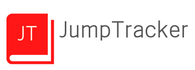
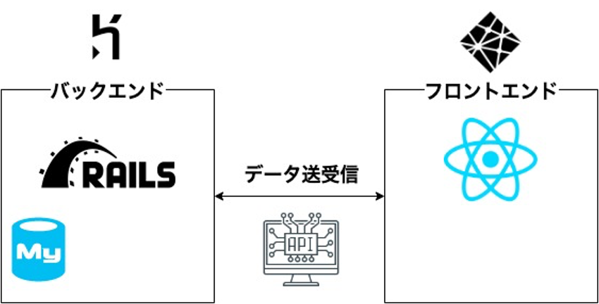
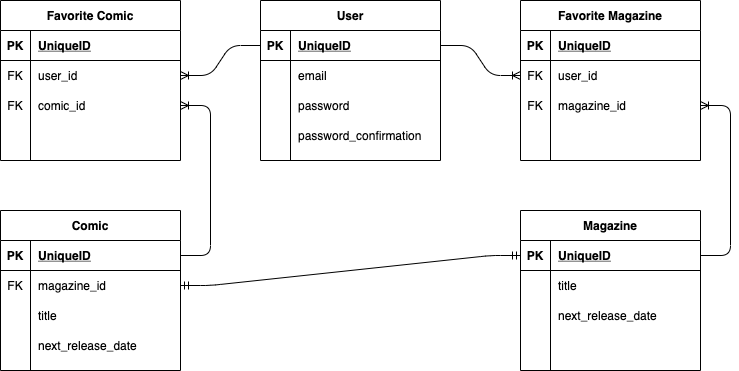
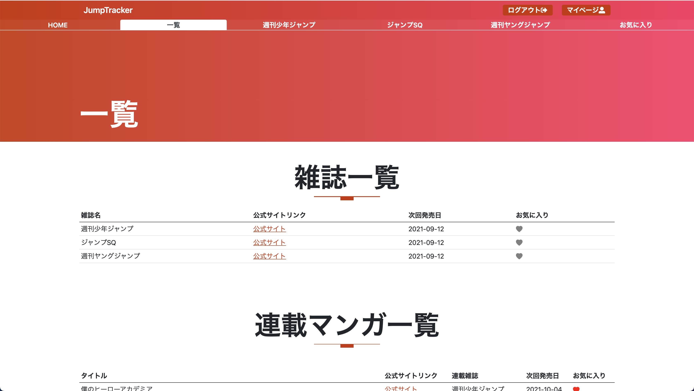
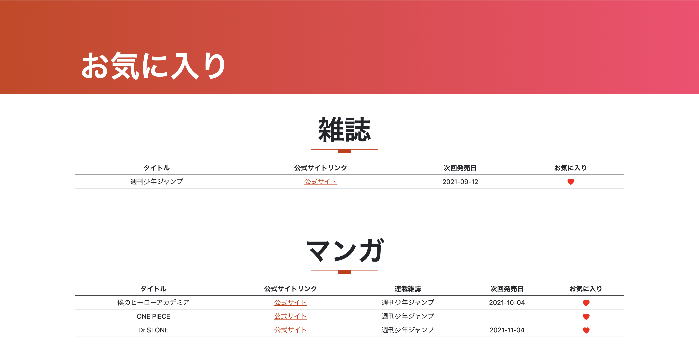

## 内容
漫画の発売日を一覧で取得することができる．
(メール・SNS通知機能も実装予定)

## 構成
### 簡単な構成図


### 簡単なER図

### フロントエンド
- React(TypeScript)

### バックエンド(API)
- Ruby on Rails
- MySQL

## デモ
```
テストユーザ
メールアドレス: sample.tracker.jump@gmail.com
パスワード: パスワード1
```

#### 一覧や各雑誌での連載一覧から，発売日を取得できる．

#### ログインしていればお気に入り登録が可能となる．


## 環境構築
※ 手元で動かす場合，docker-composeを想定しています．
1. クローン

```bash
git clone https://github.com/high-tail/JumpTracker.git
```

2. 初期セットアップ

```bash
docker-compose build

# tableの作成
docker-compose run --rm api bundle exec rails db:migrate
# 初期データ挿入
docker-compose run --rm api rake comic_list:insert_comic
docker-compose run --rm api rake comic_next_release_date:update_comic_next_release_date
docker-compose run --rm api rake magazine_next_release_date:update_magazine_next_release_date
```

### 手元で動かす場合
- アカウント作成時にメール認証を使用しているため，それを廃止する．
1. https://github.com/high-tail/JumpTracker/blob/main/backend/config/environments/development.rb#L67
2. https://github.com/high-tail/JumpTracker/blob/main/backend/config/initializers/devise_token_auth.rb#L59
3. https://github.com/high-tail/JumpTracker/blob/main/backend/config/initializers/devise_token_auth.rb#L61

1の67~78行目をコメントアウトする．2,3は該当の行をコメントアウトする

- api通信先をlocalhostにする
1. https://github.com/high-tail/JumpTracker/blob/main/frontend/jump-tracker/src/lib/api/client.ts#L12

12行目のコメントアウトを解除し，10行目をコメントアウトする


3. 動かす

```bash
# 起動
docker-compose up -d
```

4. アクセスする
- 手元の場合
http://localhost:3000

- ページ(Herokuの無料版の廃止により、ページを削除しました)
~~https://jumptracker-front.netlify.app/~~

5. 止める

```bash
docker-compose down
```

## 使用言語・OS
### 使用言語
- Ruby 3.0
- TypeScript 4.1.2
- Node 16.8.0
- MySQL 8.0

### 動作確認OS
- macOS 11.6
- Ubuntu 20.04.3

## 今後の課題
- モバイルデバイス用のviewの作成
- 発売日が近くなったらメール・SNSで通知する
- 全ユーザのお気に入り数を表示する
- ログインしていない時に，お気に入りを押すとツールチップを出す
- マイページへの機能追加(パスワード・メールアドレス変更)
- テストにおけるメール認証を突破する

## 参考文献等
- https://github.com/MuriungiPatrick/Bootstrap-5-portfolio-template
- https://github.com/lynndylanhurley/devise_token_auth
- https://github.com/formium/formik
- https://github.com/FortAwesome/react-fontawesome
